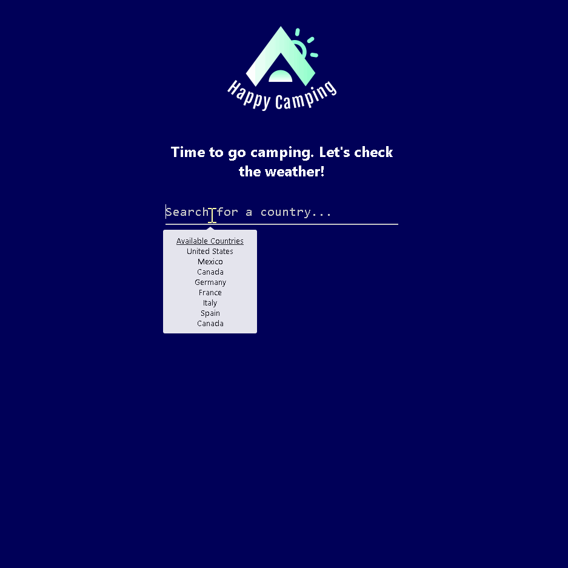

  

# Happy Camping

A React application which helps outdoor enthusiasts go camping. 
It provides weather data as well as campground locations for the user.

## Demo

[Happy Camping](https://happy-camping.herokuapp.com/)

## Technologies Used

PERN stack: PostgreSQL, Express, React, Node.js

## APIs

Problems you faced, unique elements of your project

