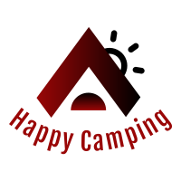

  

Title (A Title Image too if possible…Edit them on canva.com if you are not a graphic designer.)
Description(Describe by words and images alike)
Demo(Images, Video links, Live Demo links)
Technologies Used
Special Gotchas of your projects (Problems you faced, unique elements of your project)
Technical Description of your project like- Installation, Setup, How to contribute.

